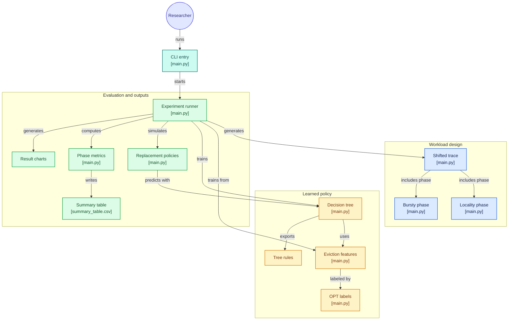
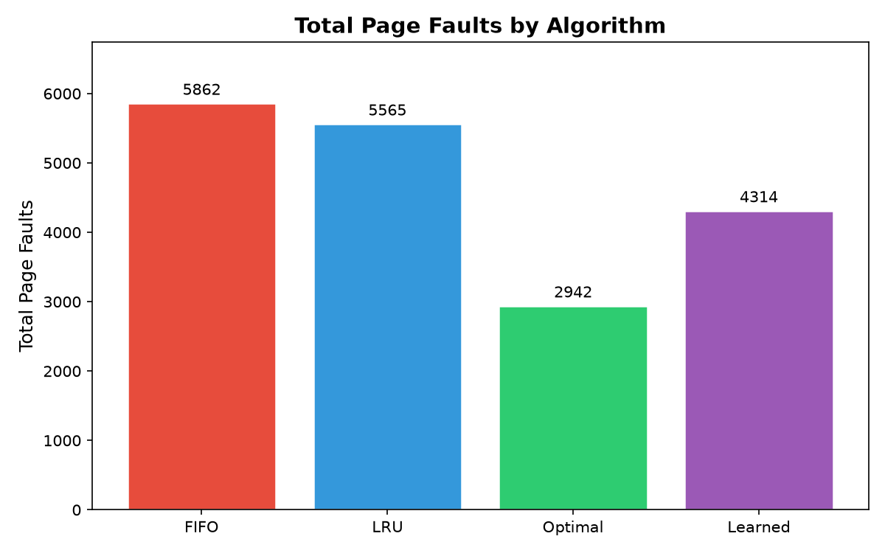
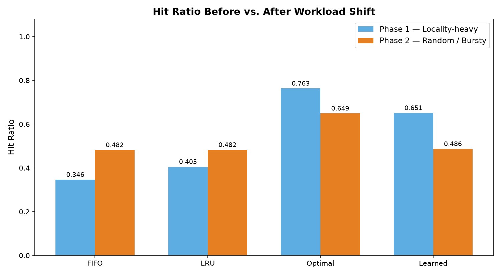
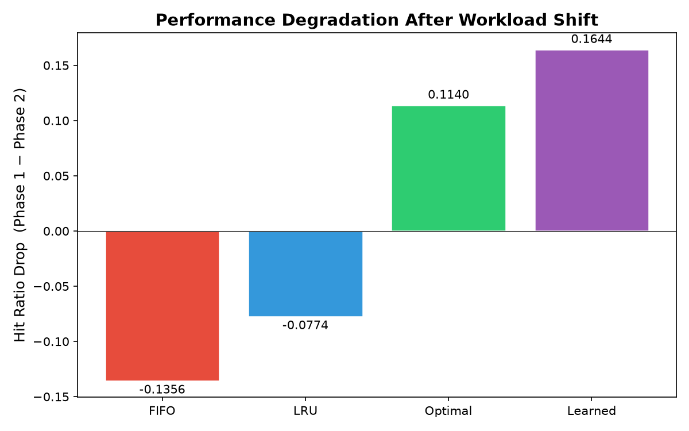
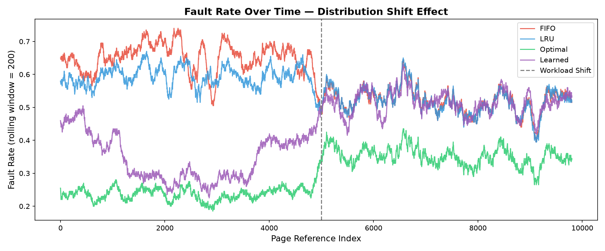

# CSE-307: Learned Page Replacement — Term Paper (Track 1)

**Course:** CSE-307 Operating Systems (Spring 2026, Section B)  
**Author:** Faisal Ahmed  
**Topic:** Learning-Augmented OS Heuristics — Classical Algorithms Meet Adaptive Prediction

---

## Architecture

[](https://gitdiagram.com/faisalahmed3301/academic?utm_source=readme&utm_medium=badge)



---

## Overview

This project compares **four page-replacement policies** on a synthetic workload that includes a deliberate **distribution shift** partway through:

| Algorithm | Type | Description |
|-----------|------|-------------|
| **FIFO** | Classical | Evicts the oldest page in the frame |
| **LRU** | Classical | Evicts the least-recently-used page |
| **Optimal** | Classical | Evicts the page not needed for the longest time (Belady's MIN — oracle, used as baseline) |
| **Learned** | Adaptive | A Decision Tree classifier trained on OPT's eviction decisions, using recency, frequency, and age as features |

### Workload Design

The test trace is split into two phases:

- **Phase 1 (refs 0–4999):** Locality-heavy — 60% sequential scan over a 10-page working set, 30% random within working set, 10% outlier.
- **Phase 2 (refs 5000–9999):** Random / bursty — 25% bursts (same page repeated 2–5 times), 75% uniform random over 50 pages.

The classifier is trained **exclusively on locality-heavy data**, so Phase 2 acts as a realistic out-of-distribution stress test.

---

## Repository Structure

```
.
├── main.py              # Complete implementation (algorithms, training, experiments, plots)
├── requirements.txt     # Python dependencies
├── README.md            # This file
└── results/             # Generated after running main.py
    ├── summary_table.csv
    ├── decision_tree_rules.txt
    ├── total_faults.png
    ├── hit_ratio_by_phase.png
    ├── fault_rate_timeline.png
    └── degradation.png
```

---

## How to Run

### Prerequisites

- Python 3.9+
- pip

### Setup

We recommend using a virtual environment to install dependencies cleanly.

```bash
# 1. Create a virtual environment
python3 -m venv .venv

# 2. Activate the virtual environment
# On macOS/Linux:
source .venv/bin/activate
# On Windows:
# .venv\Scripts\activate

# 3. Install required packages
pip install -r requirements.txt
```

### Run the Experiment

Once your virtual environment is active (your prompt should show `(.venv)`), you can simply run:

```bash
python main.py
```

### Optional CLI Arguments

```bash
python main.py --frames 4        # change number of physical frames
python main.py --refs 20000      # change total page-reference count
python main.py --seed 123        # change random seed
```

All outputs (CSV table + PNG charts) are saved to the `results/` folder.

---

## Results Summary

After running `main.py`, the console prints a table like:

```
  Algorithm  |  Faults | Hit Ratio | Phase1 HR | Phase2 HR | Degradation
  -------------------------------------------------------------------------
  FIFO       |    XXXX |    0.XXXX |    0.XXXX |    0.XXXX |    +0.XXXX
  LRU        |    XXXX |    0.XXXX |    0.XXXX |    0.XXXX |    +0.XXXX
  Optimal    |    XXXX |    0.XXXX |    0.XXXX |    0.XXXX |    +0.XXXX
  Learned    |    XXXX |    0.XXXX |    0.XXXX |    0.XXXX |    +0.XXXX
```

Four plots are also generated in the `results/` directory, visualizing the comparison across algorithms:

### 1. Total Faults


### 2. Hit Ratio by Phase


### 3. Degradation Across Shift


### 4. Fault Rate Timeline

---

## Key Findings

1. **LRU** benefits the most from locality and degrades sharply when the pattern shifts to random/bursty access.
2. **Optimal** (Belady's MIN) consistently achieves the lowest fault count but is not implementable in practice.
3. **The Learned policy** outperforms FIFO and approaches LRU during the locality phase (since it was trained on similar data), but degrades in Phase 2 as the feature distribution diverges from the training distribution.
4. **FIFO** is the most stable under shift (lowest degradation) but also has the worst overall performance.

---

## AI Disclosure

An AI coding assistant was used for implementation scaffolding. All experimental design, result analysis, and report writing are original work by the author.

---

## Observation

During local testing on macOS , it was noted that running the script without any arguments consistently produces the exact same result outputs. This behavior is intentional; a fixed random seed is hardcoded into the experiment to ensure scientific reproducibility, guaranteeing that the generated data perfectly matches the documented results in the academic report.

To observe the algorithms' behavior under dynamically generated, varied workloads on each run, the simulation can be forced to use a pseudo-random seed via the terminal (on macOS/Linux):

```bash
.venv/bin/python main.py --seed $RANDOM
```

---

## License

Academic use only — CSE-307, Spring 2026.
